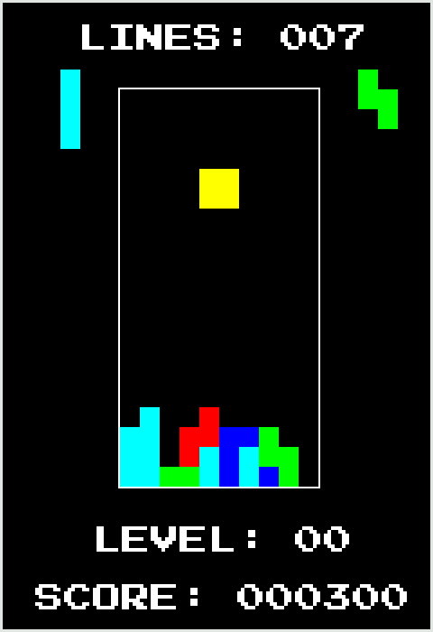

# tetris

## Run
1. Install SFML and C++
2. Run `g++ -c main.cpp`
3. Run `g++ -o main -lsfml-graphics -lsfml-window -lsfml-system`
4. Execute using `./main`

## Controls

Key(s) | Function
--- | ---
A / Left | Move left
D / Right | Move right
W / Up / X | Rotate clockwise
Z | Rotate counterclockwise
Space | Hard drop
S / Down | Soft drop
C | Hold piece
Esc / P | Pause
